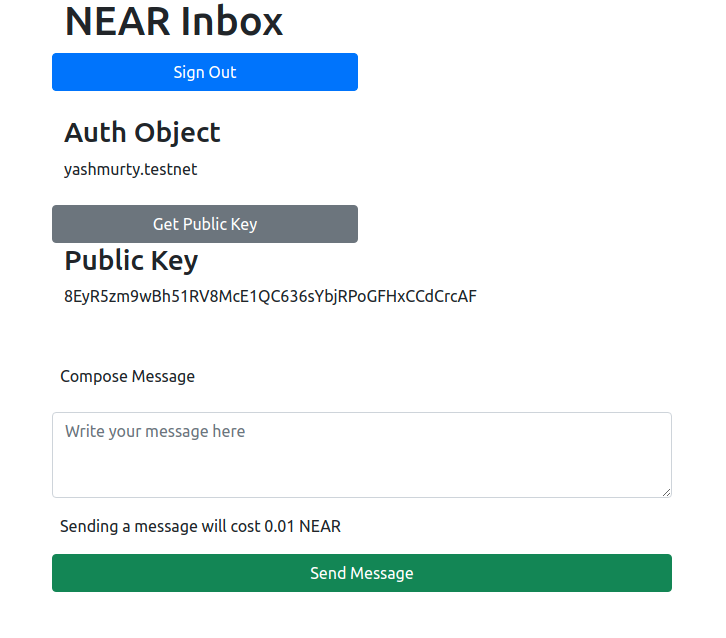

# Near Inbox

## What is Near Inbox?

An app for sending and receiving **encrypted** messages. Built on top of [NEAR](https://near.org) Protocol.

**This app was built very quickly for learning purposes, and is not intended to be used in production.**

## Features:

- The owner of the inbox can receive encrypted messages from other users.
- The messages are encrypted with the owner's public key.
- The messages can be decrypted with the owner's private key.
- The private key is loaded from the owner's NEAR credentials stored in the file system.

## TODO:

- Refactor frontend app to be more modular.
- Add tests for our smart contract.
- Use TypeScript for our node.js app.
- Move all shell script logic to node.js app.
